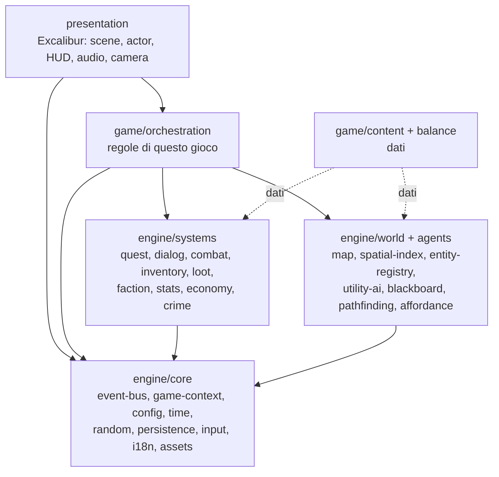

# Requisiti — Hub

**Progetto:** `rpgengine` — motore per GdR 2D top-down a tile quadrati, e un gioco costruito sopra
**Versione:** 0.2 (ristrutturazione a servizi)
**Stato:** proposto

Linguaggio dei requisiti: **DEVE** = obbligatorio, **DOVREBBE** = raccomandato, **PUÒ** = opzionale.

---

## 1. Visione

L'obiettivo non è "un gioco che funziona", ma **un insieme di servizi indipendenti, isolabili e
testabili**, ciascuno responsabile di un solo aspetto (mappa, quest, inventario, dialoghi, IA,
generazione procedurale, caratteristiche del personaggio, numeri casuali, input, persistenza…), più
un gioco che li assembla.

Da questo discendono tre conseguenze che valgono come vincoli di progetto:

1. **Il motore non conosce il gioco.** Un servizio del motore non sa che esiste "la spada di
   Aramis", né che il giocatore ha una statistica chiamata *Carisma*: sa gestire *oggetti* e
   *statistiche* definiti altrove, come dati.
2. **I servizi non si conoscono tra loro.** Le regole che li collegano ("uccidi il boss → avanza la
   quest → sblocca un'opzione di dialogo") sono regole *di questo gioco* e vivono in uno strato di
   **orchestrazione** sopra il motore, non dentro i servizi.
3. **Ogni servizio è testabile da solo, headless.** In un runner Node, senza Excalibur, senza
   canvas, senza asset, senza gli altri servizi.

---

## 2. Mappa della documentazione

| Documento | Contenuto |
|---|---|
| `REQUIREMENTS.md` *(questo file)* | Visione, principi architetturali `ARC-*`, catalogo dei servizi, regole di confine, priorità |
| [`GAMEPLAY.md`](./GAMEPLAY.md) | Cosa deve fare **il gioco**: feature viste dal giocatore, con rimando ai servizi che le realizzano |
| [`MAP-REQUIREMENTS.md`](./MAP-REQUIREMENTS.md) | Struttura mappa a livelli e rendering del terreno (Dual Grid System). Possiede i requisiti `MAP-1…MAP-9` |
| [`services/*.md`](./services/) | Una scheda per servizio: contratto, API, requisiti numerati, criteri di test |

### Convenzioni

- Ogni servizio ha un **prefisso di requisito** stabile (`RND-*`, `QST-*`, …). Gli ID **non
  vengono riusati**: se un requisito viene rimosso, il suo numero resta vacante.
- Ogni scheda di servizio segue lo **stesso template**: Scopo → Contratto → API pubblica →
  Requisiti → Criteri di test → Collegamenti.
- Le firme TypeScript nelle schede sono **indicative**: fissano la forma e le responsabilità del
  contratto, non l'implementazione.

---

## 3. Glossario

- **Servizio** — unità di funzionalità con una superficie pubblica unica, uno stato proprio e
  nessuna dipendenza dagli altri servizi. È l'unità di isolamento, di test e di riuso.
- **Motore (`engine/`)** — l'insieme dei servizi generici, riusabili in un altro gioco 2D.
- **Gioco (`game/`)** — contenuti, bilanciamento e orchestrazione specifici di questo progetto.
- **Orchestrazione** — lo strato che collega i servizi tra loro reagendo agli eventi di dominio e
  invocando le API dei servizi. Codifica le regole di *questo* gioco.
- **Evento di dominio** — notifica immutabile e serializzabile di un fatto già avvenuto
  (`entity-died`, `item-picked`). Non è un comando e non ha valore di ritorno.
- **Porta** — interfaccia minima dichiarata da un consumatore per esprimere ciò di cui ha bisogno.
- **Stato statico** — definizioni caricate da file di contenuto, immutabili a runtime.
- **Stato dinamico** — stato che cambia durante la partita; è l'unico che viene serializzato.
- **Headless** — eseguibile e testabile senza motore grafico, canvas o asset.

---

## 4. Principi architetturali

### ARC-1 — Separazione presentazione / dominio

**ARC-1.1** — Il codice **DEVE** essere organizzato in strati con dipendenze a senso unico:
presentazione → gioco → motore. Nessuna dipendenza risale.

**ARC-1.2** — Nessun file sotto `engine/` **DEVE** importare `excalibur` o qualunque API di
rendering, DOM o audio. La regola è verificabile automaticamente (vedi ARC-14).

**ARC-1.3** — Lo stato di dominio **NON DEVE** contenere riferimenti ad `Actor` o a nodi di
rendering. Il legame runtime `Actor ↔ modello` è mantenuto solo dalla presentazione, tipicamente
come mappa `EntityId → Actor`.

**ARC-1.4** — La presentazione **DEVE** essere sostituibile: la stessa partita **DEVE** poter
girare senza alcun renderer (simulazione headless), condizione che rende i test di sistema
possibili.

### ARC-2 — Tutto è un servizio

**ARC-2.1** — Ogni aspetto del gioco **DEVE** essere realizzato come servizio con una **superficie
pubblica unica** (`index.ts`): tutto ciò che non è esportato da lì è privato del servizio.

**ARC-2.2** — Un servizio **DEVE** poter essere compilato, testato ed eseguito senza gli altri
servizi, sostituendo le sue dipendenze con fake.

**ARC-2.3** — Un servizio **DEVE** avere una scheda in `docs/services/` con il contratto compilato.
Un servizio senza scheda non esiste.

**ARC-2.4** — Preferire **più servizi piccoli e ottusi** a un servizio grande e intelligente: se una
scheda accumula responsabilità eterogenee, il servizio **DOVREBBE** essere scorporato.

### ARC-3 — Motore riusabile, gioco separato

**ARC-3.1** — Ogni servizio **DEVE** dichiarare nella propria scheda la sua **natura**:
*generico* (nessuna conoscenza di questo gioco) oppure *di dominio* (accetta il modello di dominio
di questo progetto).

**ARC-3.2** — Un servizio generico **NON DEVE** contenere costanti, nomi, identificativi o regole di
bilanciamento di questo gioco: li riceve come **dati** o come **configurazione**.

**ARC-3.3** — I servizi generici **DEVONO** essere parametrici sul modello dei dati dove ciò non
degrada l'ergonomia: un servizio inventario gestisce "oggetti con id, peso e tag", non "spade".

**ARC-3.4** — La prova di riusabilità è un test: ogni servizio generico **DOVREBBE** avere almeno
un test che lo esercita con un dominio inventato, diverso da quello del gioco.

### ARC-4 — Servizi muti, orchestrazione esplicita

**ARC-4.1** — Un servizio **NON DEVE** importare né ricevere per iniezione un altro servizio. Le
sole dipendenze ammesse sono i servizi di infrastruttura elencati nella propria scheda
(tipicamente: nessuna).

**ARC-4.2** — Un comando di servizio **DEVE** restituire l'esito e gli **eventi di dominio**
prodotti, invece di pubblicarli da sé. Pubblicare è responsabilità del chiamante.

```ts
type CommandResult<T> = { value: T; events: DomainEvent[] };
```

**ARC-4.3** — Nessun servizio **DEVE** sottoscrivere eventi. I sottoscrittori ammessi sono lo strato
di orchestrazione e la presentazione.

**ARC-4.4** — Il collegamento tra servizi **DEVE** vivere in `game/orchestration/`, suddiviso per
tema (regole di quest, regole di crimine, regole di economia…), non in un unico file.

**ARC-4.5** — Le regole di orchestrazione **DOVREBBERO** essere data-driven ove la forma lo consenta
(ARC-7), riducendo l'orchestrazione a codice a un insieme piccolo di casi irriducibili.

**ARC-4.6** — Il grafo delle dipendenze tra servizi **DEVE** essere aciclico. Poiché ARC-4.1 vieta
le dipendenze dirette, questo è garantito per costruzione: i cicli concettuali
(quest ↔ inventario ↔ dialoghi) si risolvono nell'orchestrazione.

### ARC-5 — EventBus tipizzato e riferimenti stabili

**ARC-5.1** — Gli eventi di dominio **DEVONO** essere una **union discriminata** tipizzata, chiusa e
serializzabile: nessun payload contenente funzioni, `Actor`, `Map`, `Set` o riferimenti runtime.

**ARC-5.2** — Le entità **DEVONO** essere referenziate tramite un **`EntityId` opaco e stabile**,
mai per nome-stringa e mai cercando nella scena.

**ARC-5.3** — Stati, direzioni, tag e categorie **DEVONO** essere enum o costanti tipizzate; nessuna
stringa magica.

**ARC-5.4** — L'ordine di consegna degli eventi **DEVE** essere deterministico e documentato
(vedi [`services/event-bus.md`](./services/event-bus.md)).

### ARC-6 — Composizione a componenti e capacità

**ARC-6.1** — Le entità **DEVONO** essere modellate come **composizione di componenti**
(`Health`, `Combat`, `Inventory`, `Dialog`, `Faction`, `Loot`, `Interactable`…), non con gerarchie
di classi (`NpcActor → Slime/Merchant`, `Item → Weapon → Sword`).

**ARC-6.2** — Un componente **DEVE** poter essere usato come **marcatore di capacità**, cioè come
dichiarazione al mondo che l'entità partecipa a una certa interazione. Tutto ciò che può essere
bersagliato — giocatore, PNG, serratura, barile esplosivo, telecamera, porta — è tale perché
**possiede il componente**, non perché appartiene a una classe.

**ARC-6.3** — Le query per capacità (*"tutte le entità bersagliabili entro 5 tile"*) **DEVONO**
essere una primitiva efficiente del registro entità, non una scansione della scena
(vedi [`services/entity-registry.md`](./services/entity-registry.md),
[`services/spatial-index.md`](./services/spatial-index.md)).

**ARC-6.4** — Casi come "mercante che sa combattere" o "slime amichevole" **DEVONO** ottenersi
aggiungendo o togliendo componenti, senza nuovi rami di classi.

**ARC-6.5** — La logica di ogni componente di dominio **DEVE** essere testabile in isolamento, senza
motore grafico.

### ARC-7 — Contenuti data-driven, validati, interpretati

**ARC-7.1** — Quest, dialoghi, definizioni di oggetti e nemici, loot table, tabelle prezzi, curve di
IA, parametri di generazione **DEVONO** risiedere in **file dati** (JSON/YAML), non come letterali
TypeScript dentro le classi.

**ARC-7.2** — I dati **DEVONO** essere validati al caricamento con uno schema (es. Zod), con errori
diagnostici che indicano file, percorso e valore. Un contenuto non valido **DEVE** fallire in
caricamento, non a metà partita.

**ARC-7.3** — Precondizioni ed effetti **DEVONO** essere modellati come **union discriminate**
(`{ type: 'player-in-area', area: string }`) e valutati da un **interprete** dedicato. I repository
**leggono** i dati: non li contengono e non li interpretano.

**ARC-7.4** — Un game o narrative designer **DEVE** poter modificare i contenuti **senza
ricompilare** il gioco.

**ARC-7.5** — Ogni riferimento incrociato tra contenuti (quest → oggetto, dialogo → quest)
**DEVE** essere verificabile da un controllo di integrità eseguibile offline.

### ARC-8 — Nessuno stato globale: GameContext e DI

**ARC-8.1** — **NON DEVE** esistere alcun singleton mutabile esportato dal bootstrap e importato in
profondità, né dipendenze circolari `main → Scene → Actor → main`.

**ARC-8.2** — Le dipendenze **DEVONO** essere iniettate via costruttore, radunate in un
**GameContext** costruito una sola volta nel bootstrap
(vedi [`services/game-context.md`](./services/game-context.md)).

**ARC-8.3** — Deve essere possibile istanziare **più partite indipendenti** nello stesso processo:
è la verifica pratica dell'assenza di stato globale, e serve ai test.

**ARC-8.4** — Lo stato di selezione e di interfaccia appartiene alla presentazione, mai al dominio.

### ARC-9 — Determinismo e riproducibilità

**ARC-9.1** — Data la stessa partita salvata e la stessa sequenza di input, la simulazione **DEVE**
produrre lo stesso risultato.

**ARC-9.2** — Nessun accesso diretto a `Math.random()` **DEVE** esistere fuori dal servizio Random.

**ARC-9.3** — Nessun accesso diretto all'orologio di sistema **DEVE** esistere fuori dal servizio
Time: il dominio riceve il tempo, non lo legge.

**ARC-9.4** — L'iterazione su collezioni in punti che influenzano l'esito **DEVE** avere ordine
definito (nessuna dipendenza dall'ordine di inserimento in una `Map` non documentato).

### ARC-10 — Serializzabilità

**ARC-10.1** — La distinzione tra **stato statico** (definizioni) e **stato dinamico** (salvabile)
**DEVE** essere esplicita in ogni servizio, e dichiarata nella sua scheda.

**ARC-10.2** — Ogni servizio con stato dinamico **DEVE** esporre `serialize()` / `deserialize()` per
la **sua sola porzione** di stato, con un numero di versione proprio.

**ARC-10.3** — Lo stato dinamico **DEVE** referenziare lo stato statico tramite **ID stabili**, mai
per indice o per posizione in un array.

**ARC-10.4** — Lo stato serializzabile **NON DEVE** contenere riferimenti runtime (ARC-1.3), né
funzioni, né valori derivabili per ricalcolo se questi possono divergere.

### ARC-11 — Testabilità e rigore

**ARC-11.1** — Il progetto **DEVE** avere un test runner headless (Vitest o equivalente) separato
dai test end-to-end Playwright già presenti.

**ARC-11.2** — Ogni servizio **DEVE** avere unit test sulla propria logica; i servizi che producono
valori casuali o statistici **DEVONO** avere test di proprietà (media, varianza, continuità,
riproducibilità da seed).

**ARC-11.3** — `as any` e `undefined as any` **NON DEVONO** comparire nel codice di produzione;
`strict` **DEVE** essere attivo in TypeScript.

**ARC-11.4** — Prima di rifattorizzare codice esistente **DOVREBBERO** essere scritti test di
caratterizzazione che ne congelano il comportamento.

**ARC-11.5** — Artefatti di build (`dist/`) **DEVONO** essere in `.gitignore`.

### ARC-12 — Configurazione, localizzazione, asset

**ARC-12.1** — I parametri di bilanciamento **DEVONO** essere centralizzati e tipizzati
(vedi [`services/config.md`](./services/config.md)): nessun magic number sparso (z-order, griglie
sprite, soglie di IA, timer di respawn).

**ARC-12.2** — Nessuna stringa mostrata al giocatore **DEVE** essere hardcoded: i testi passano dal
servizio di localizzazione (vedi [`services/localization.md`](./services/localization.md)).

**ARC-12.3** — Il caricamento degli asset **DEVE** essere data-driven, coerente con il caricamento
da Tiled già usato per il posizionamento spaziale.

### ARC-13 — Performance

**ARC-13.1** — Nessuna scansione O(n) della scena per entità per tick: le query di prossimità
passano dall'indice spaziale.

**ARC-13.2** — I sistemi costosi (IA, pathfinding, rigenerazione mercanti) **DEVONO** supportare
**throttling**: raggio di attivazione e intervallo discreto di rivalutazione, con distribuzione del
carico tra i frame (budget per frame).

**ARC-13.3** — Nessun logging né allocazione evitabile negli hot path.

**ARC-13.4** — Ogni servizio **DOVREBBE** dichiarare nella propria scheda l'ordine di grandezza
atteso di entità/chiamate che deve reggere.

### ARC-14 — Confini verificati automaticamente

**ARC-14.1** — I confini tra servizi **DEVONO** essere imposti da uno strumento (ESLint
`no-restricted-imports`, `dependency-cruiser` o equivalente) eseguito in CI, non dalla sola
disciplina.

**ARC-14.2** — Regole minime da imporre:

| # | Regola |
|---|---|
| 1 | Nessun import di `excalibur` sotto `engine/` |
| 2 | Import di un servizio ammesso solo dal suo `index.ts` (mai percorsi interni) |
| 3 | Nessun import da un servizio a un altro servizio (ARC-4.1) |
| 4 | Nessun import da `engine/` verso `game/` o `presentation/` |
| 5 | Nessun import da `game/` verso `presentation/` |
| 6 | Nessun ciclo di import in tutto `src/` |

**ARC-14.3** — La violazione di una regola di confine **DEVE** far fallire la build.

---

## 5. Catalogo dei servizi

**Natura:** G = generico (riusabile) · D = di dominio (assume il modello RPG di questo progetto).
**Prio:** priorità di adozione (vedi §8).

### Core — infrastruttura

| ID | Servizio | Scheda | Natura | Prio |
|---|---|---|---|---|
| `BUS` | EventBus | [event-bus.md](./services/event-bus.md) | G | 1 |
| `CTX` | GameContext / DI | [game-context.md](./services/game-context.md) | G | 1 |
| `CFG` | Config e bilanciamento | [config.md](./services/config.md) | G | 1 |
| `TIME` | Tempo di gioco e scheduler | [time.md](./services/time.md) | G | 1 |
| `RND` | Numeri casuali | [random.md](./services/random.md) | G | 1 |
| `SAVE` | Persistenza | [persistence.md](./services/persistence.md) | G | 2 |
| `INP` | Input | [input.md](./services/input.md) | G | 2 |
| `I18N` | Localizzazione | [localization.md](./services/localization.md) | G | 3 |
| `AST` | Asset e risorse | [assets.md](./services/assets.md) | G | 3 |

### Mondo

| ID | Servizio | Scheda | Natura | Prio |
|---|---|---|---|---|
| `MAP` | Mappa: griglia dati e collisione | [map.md](./services/map.md) + [MAP-REQUIREMENTS.md](./MAP-REQUIREMENTS.md) | G | 1 |
| `GEN` | Generazione procedurale di mappe | [map-generation.md](./services/map-generation.md) | G | 3 |
| `SPX` | Indice spaziale | [spatial-index.md](./services/spatial-index.md) | G | 2 |
| `ENT` | Registro entità e componenti | [entity-registry.md](./services/entity-registry.md) | G | 1 |

### Agenti

| ID | Servizio | Scheda | Natura | Prio |
|---|---|---|---|---|
| `BB` | Blackboard | [blackboard.md](./services/blackboard.md) | G | 3 |
| `AI` | Utility-AI | [utility-ai.md](./services/utility-ai.md) | G | 3 |
| `AFF` | Affordance e percezione | [affordance.md](./services/affordance.md) | G | 4 |
| `PATH` | Pathfinding | [pathfinding.md](./services/pathfinding.md) | G | 3 |

### Regole di gioco

| ID | Servizio | Scheda | Natura | Prio |
|---|---|---|---|---|
| `STAT` | Caratteristiche e progressione | [stats.md](./services/stats.md) | D | 2 |
| `CBT` | Combattimento | [combat.md](./services/combat.md) | D | 2 |
| `INV` | Inventario ed equipaggiamento | [inventory.md](./services/inventory.md) | G | 2 |
| `LOOT` | Loot table e drop | [loot.md](./services/loot.md) | G | 3 |
| `QST` | Quest | [quest.md](./services/quest.md) | G | 2 |
| `DLG` | Dialoghi | [dialog.md](./services/dialog.md) | G | 2 |
| `FAC` | Fazioni e reputazione | [faction.md](./services/faction.md) | G | 3 |
| `ECO` | Economia e commercio | [economy.md](./services/economy.md) | D | 4 |
| `CRM` | Crimine e notorietà | [crime.md](./services/crime.md) | D | 4 |

### Presentazione

| ID | Servizio | Scheda | Natura | Prio |
|---|---|---|---|---|
| `REN` | Rendering e adattatore di scena | [rendering.md](./services/rendering.md) | D | 1 |
| `HUD` | HUD e schermate | [hud.md](./services/hud.md) | D | 3 |
| `AUD` | Audio | [audio.md](./services/audio.md) | G | 4 |
| `CAM` | Camera | [camera.md](./services/camera.md) | G | 3 |

---

## 6. Struttura delle cartelle

```
src/
├─ engine/                    Generico e riusabile. Nessun import da excalibur.
│  ├─ core/
│  │  ├─ event-bus/  game-context/  config/  time/  random/
│  │  └─ persistence/  input/  i18n/  assets/
│  ├─ world/
│  │  └─ map/  map-generation/  spatial-index/  entity-registry/
│  ├─ agents/
│  │  └─ blackboard/  utility-ai/  affordance/  pathfinding/
│  └─ systems/                Motori di regole generici, non le regole di questo gioco
│     └─ stats/  combat/  inventory/  loot/  quest/  dialog/  faction/  economy/  crime/
│
├─ game/                      Questo gioco specifico
│  ├─ orchestration/          Cablaggio tra servizi, per tema (ARC-4.4)
│  ├─ content/                Dati: quests, dialogs, items, npcs, loot, prices, maps + schema
│  ├─ balance/                Valori di bilanciamento (CFG)
│  └─ bootstrap.ts            Costruzione del GameContext
│
└─ presentation/              Excalibur: Scene, Actor, rendering, HUD, audio, camera, input fisico
   └─ map/                    Rendering terreno (TileMap DGS), z-order per Y, overhead
```

Ogni cartella di servizio ha la stessa forma:

```
engine/core/random/
├─ index.ts        Unica superficie pubblica (ARC-2.1)
├─ types.ts        Tipi del contratto
├─ …               Implementazione privata
└─ *.spec.ts       Test headless
```

---

## 7. Grafo delle dipendenze

Le frecce sono dipendenze di **import**. Si noti l'assenza di frecce tra servizi (ARC-4.1): il
collegamento avviene per eventi risaliti all'orchestrazione.



Ciclo di vita di un'interazione, come esempio di lettura del grafo:

1. La **presentazione** rileva un input e lo traduce in azione astratta (`INP`).
2. L'**orchestrazione** invoca `CBT.resolveAttack(...)`, che restituisce esito ed eventi.
3. L'orchestrazione **pubblica** gli eventi sul `BUS`.
4. Altri moduli di orchestrazione reagiscono: `QST.notifyKill(...)`, `LOOT.roll(...)`,
   `FAC.applyReputationDelta(...)`, ciascuno restituendo altri eventi.
5. La **presentazione** osserva gli stessi eventi per animazioni, numeri di danno, suoni.

Nessuno dei servizi coinvolti sa dell'esistenza degli altri.

---

## 8. Priorità di adozione

| Prio | Contenuto | Obiettivo |
|---|---|---|
| **1 — Fondamenta** | `BUS` `CTX` `CFG` `TIME` `RND` `ENT` `MAP` `REN` | Un mondo che si carica, si disegna e si muove, con architettura corretta dal primo giorno |
| **2 — Gioco minimo** | `SPX` `INP` `STAT` `CBT` `INV` `QST` `DLG` `SAVE` | Un ciclo di gioco completo: esplora, combatti, parla, raccogli, salva |
| **3 — Profondità** | `AI` `BB` `PATH` `LOOT` `FAC` `GEN` `HUD` `CAM` `I18N` `AST` | PNG credibili, mondo variabile, interfaccia completa |
| **4 — Simulazione** | `AFF` `ECO` `CRM` `AUD` | Mondo reattivo e sistemico |

Regola trasversale: **ARC-1, ARC-2, ARC-4, ARC-8, ARC-11 e ARC-14 valgono dal primo commit.** Sono
vincoli strutturali: aggiungerli dopo significa riscrivere, come documentato in
[`previous-version/REPORT-VALUTAZIONE.md`](./previous-version/REPORT-VALUTAZIONE.md).

---

## 9. Tracciabilità rispetto alla versione 0.1

I requisiti tecnici `TR1…TR13` della versione precedente sono stati assorbiti così:

| Vecchio | Destinazione |
|---|---|
| TR1 — Separazione presentazione/dominio | ARC-1 |
| TR2 — Composizione a componenti (ECS) | ARC-6 + [`entity-registry.md`](./services/entity-registry.md) |
| TR3 — Contenuti data-driven | ARC-7 |
| TR4 — EventBus e riferimenti stabili | ARC-5 + [`event-bus.md`](./services/event-bus.md) + ARC-13.1 |
| TR5 — Niente stato globale, DI | ARC-8 + [`game-context.md`](./services/game-context.md) |
| TR6 — Utility-AI | [`utility-ai.md`](./services/utility-ai.md) |
| TR7 — Combattimento centralizzato | [`combat.md`](./services/combat.md) |
| TR8 — Input centralizzato | [`input.md`](./services/input.md) |
| TR9 — Persistenza | ARC-10 + [`persistence.md`](./services/persistence.md) |
| TR10 — RNG deterministico | ARC-9 + [`random.md`](./services/random.md) |
| TR11 — Testabilità e qualità | ARC-11 |
| TR12 — Config, i18n, asset | ARC-12 + [`config.md`](./services/config.md), [`localization.md`](./services/localization.md), [`assets.md`](./services/assets.md) |
| TR13 — RNG avanzato | [`random.md`](./services/random.md) |
| Feature di gioco (Giocatore, Mappa, Quest, …) | [`GAMEPLAY.md`](./GAMEPLAY.md) |
| Note "Da aggiungere ai requisiti" | ARC-2, ARC-6.2, [`blackboard.md`](./services/blackboard.md), [`utility-ai.md`](./services/utility-ai.md), [`affordance.md`](./services/affordance.md) |
