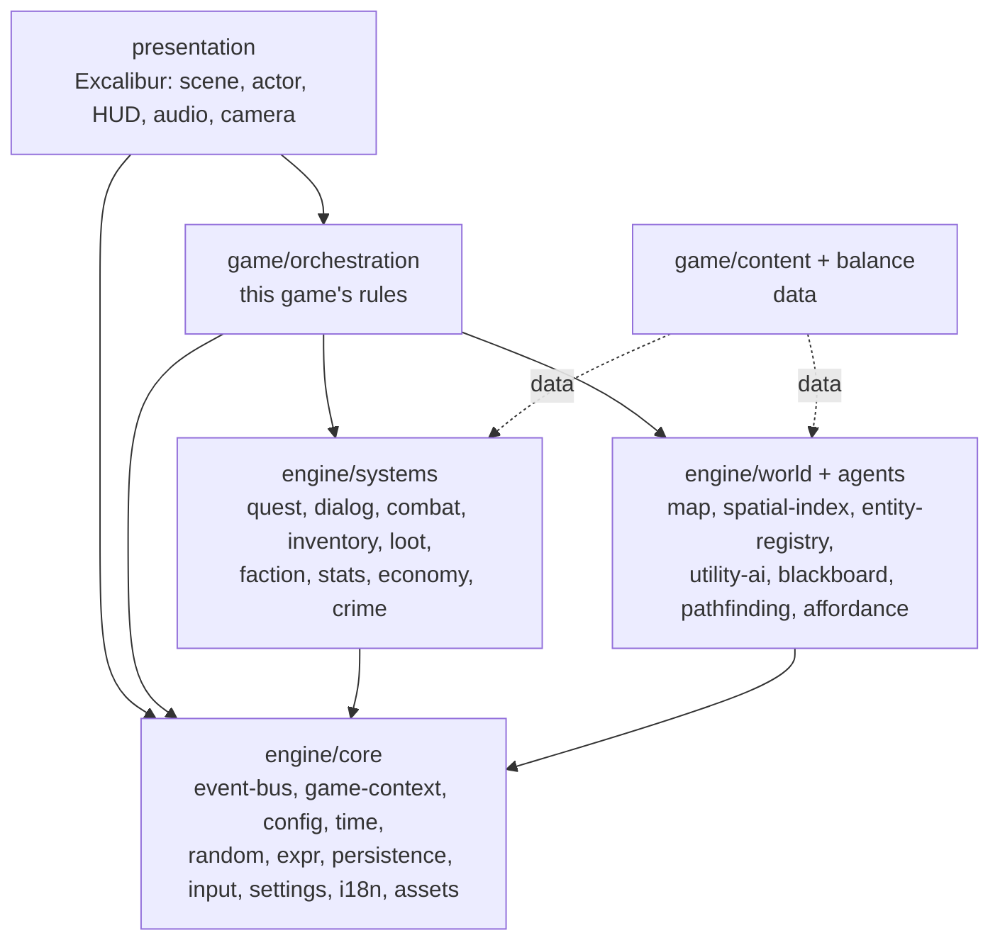
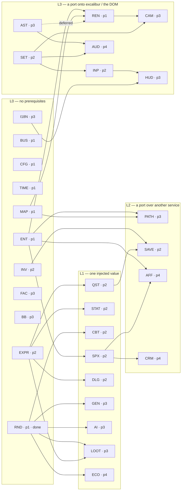

# Requirements — Hub

**Project:** `rpgengine` — an engine for 2D top-down RPGs on square tiles, and a game built on top
**Version:** 0.2 (restructured around services)
**Status:** proposed

Requirement language: **MUST** = mandatory, **SHOULD** = recommended, **MAY** = optional.

---

## 1. Vision

The goal is not "a game that works", but **a set of independent, isolable and testable services**,
each responsible for a single aspect (map, quests, inventory, dialogues, AI, procedural generation,
character attributes, random numbers, input, persistence…), plus a game that assembles them.

Three consequences follow, and they count as project constraints:

1. **The engine does not know the game.** An engine service does not know that "Aramis's sword"
   exists, nor that the player has an attribute called *Charisma*: it knows how to handle *items*
   and *attributes* defined elsewhere, as data.
2. **The services do not know each other.** The rules that connect them ("kill the boss → advance
   the quest → unlock a dialogue option") are rules *of this game* and live in an **orchestration**
   layer above the engine, not inside the services.
3. **Every service is testable on its own, headless.** In a Node runner, without Excalibur, without
   a canvas, without assets, without the other services.

---

## 2. Documentation map

| Document | Content |
|---|---|
| [`../CONTEXT.md`](../CONTEXT.md) | **The project's language**: the single glossary of domain terms, with the synonyms to avoid. A term is defined there, and only there |
| `REQUIREMENTS.md` *(this file)* | Vision, architectural principles `ARC-*`, service catalogue, boundary rules, priorities |
| [`GAMEPLAY.md`](./GAMEPLAY.md) | What **the game** must do: features seen by the player, pointing to the services that implement them |
| [`MAP-REQUIREMENTS.md`](./MAP-REQUIREMENTS.md) | Layered map structure and terrain rendering (Dual Grid System). Owns requirements `MAP-1…MAP-9` |
| [`services/*.md`](./services/) | One sheet per service: contract, API, numbered requirements, test criteria |
| [`adr/*.md`](./adr/) | **Why** a hard-to-reverse decision was taken this way, and which alternatives were rejected |
| [`specs/*.md`](./specs/) | How a service is built: problem, user stories, technical and testing decisions, what stays out |

### Conventions

- Every service has a stable **requirement prefix** (`RND-*`, `QST-*`, …). IDs are **not reused**:
  if a requirement is removed, its number stays vacant.
- Every service sheet follows the **same template**: Purpose → Contract → Public API →
  Requirements → Test criteria → Links.
- The TypeScript signatures in the sheets are **indicative**: they fix the shape and the
  responsibilities of the contract, not the implementation.
- An **ADR** is written only when the decision is hard to reverse, surprises whoever reads the code,
  and is the result of a genuine trade-off. The sheets say *what*; the ADRs say *why not the other
  way*.

| ADR | Decision |
|---|---|
| [`0001`](./adr/0001-bit-for-bit-reproducibility.md) | Bit-for-bit reproducibility across JavaScript engines: `xoshiro128**`, no transcendental functions, Gaussian by sum of uniforms |
| [`0002`](./adr/0002-weight-readjustment.md) | Filtered randomness by weight readjustment, not by re-rolling |
| [`0003`](./adr/0003-dialogues-in-ink.md) | Dialogues written in ink and run with inkjs, instead of a graph format of our own |
| [`0004`](./adr/0004-presentation-may-reach-a-service.md) | The presentation reaches a service directly, through its public surface, without passing through `game/` |

---

## 3. Architectural principles

### ARC-1 — Presentation / domain separation

**ARC-1.1** — The code **MUST** be organized into layers with one-way dependencies: presentation →
game → engine. No dependency goes back up.

**ARC-1.2** — No file under `engine/` **MUST** import `excalibur` or any rendering, DOM or audio
API. The rule is automatically verifiable (see ARC-14).

**ARC-1.3** — Domain state **MUST NOT** contain references to `Actor`s or to rendering nodes. The
runtime `Actor ↔ model` binding is maintained only by the presentation, typically as an
`EntityId → Actor` map.

**ARC-1.4** — The presentation **MUST** be replaceable: the same game **MUST** be able to run with
no renderer at all (headless simulation), a condition that makes system tests possible.

### ARC-2 — Everything is a service

**ARC-2.1** — Every aspect of the game **MUST** be implemented as a service with a **single public
surface** (`index.ts`): everything not exported from there is private to the service.

**ARC-2.2** — A service **MUST** be compilable, testable and runnable without the other services, by
replacing its dependencies with fakes.

**ARC-2.3** — A service **MUST** have a sheet in `docs/services/` with the contract filled in. A
service without a sheet does not exist.

**ARC-2.4** — Prefer **several small, dumb services** to one large, clever one: if a sheet
accumulates heterogeneous responsibilities, the service **SHOULD** be split.

### ARC-3 — Reusable engine, separate game

**ARC-3.1** — Every service **MUST** declare its **nature** in its own sheet: *generic* (no
knowledge of this game) or *domain* (accepts this project's domain model).

**ARC-3.2** — A generic service **MUST NOT** contain constants, names, identifiers or balancing
rules from this game: it receives them as **data** or as **configuration**.

**ARC-3.3** — Generic services **MUST** be parametric on the data model where that does not degrade
ergonomics: an inventory service handles "items with an id, a weight and tags", not "swords".

**ARC-3.4** — The proof of reusability is a test: every generic service **SHOULD** have at least one
test that exercises it with a made-up domain, different from the game's.

### ARC-4 — Mute services, explicit orchestration

**ARC-4.1** — A service **MUST NOT** import nor receive another service by injection. The only
dependencies allowed are the infrastructure services listed in its own sheet (typically: none).

**ARC-4.2** — A service command **MUST** return the outcome and the **domain events** produced,
instead of publishing them itself. Publishing is the caller's responsibility.

```ts
type CommandResult<T> = { value: T; events: DomainEvent[] };
```

**ARC-4.3** — No service **MUST** subscribe to events. The permitted subscribers are the
orchestration layer and the presentation.

**ARC-4.4** — The wiring between services **MUST** live in `game/orchestration/`, split by theme
(quest rules, crime rules, economy rules…), not in a single file.

**ARC-4.5** — Orchestration rules **SHOULD** be data-driven wherever their shape allows (ARC-7),
reducing orchestration-as-code to a small set of irreducible cases.

**ARC-4.6** — The dependency graph between services **MUST** be acyclic. Since ARC-4.1 forbids direct
dependencies, this is guaranteed by construction: the conceptual cycles (quests ↔ inventory ↔
dialogues) are resolved in the orchestration.

### ARC-5 — Typed EventBus and stable references

**ARC-5.1** — Domain events **MUST** be a typed, closed and serializable **discriminated union**: no
payload containing functions, `Actor`s, `Map`s, `Set`s or runtime references.

**ARC-5.2** — Entities **MUST** be referenced through an **opaque and stable `EntityId`**, never by
string name and never by searching the scene.

**ARC-5.3** — States, directions, tags and categories **MUST** be enums or typed constants; no magic
strings.

**ARC-5.4** — The event delivery order **MUST** be deterministic and documented (see
[`services/event-bus.md`](./services/event-bus.md)).

### ARC-6 — Component composition and capabilities

**ARC-6.1** — Entities **MUST** be modelled as a **composition of components** (`Health`, `Combat`,
`Inventory`, `Dialog`, `Faction`, `Loot`, `Interactable`…), not with class hierarchies
(`NpcActor → Slime/Merchant`, `Item → Weapon → Sword`).

**ARC-6.2** — A component **MUST** be usable as a **capability marker**, that is, as a declaration to
the world that the entity takes part in a given interaction. Everything that can be targeted —
player, NPC, lock, explosive barrel, camera, door — is so because it **owns the component**, not
because it belongs to a class.

**ARC-6.3** — Queries by capability (*"all targetable entities within 5 tiles"*) **MUST** be an
efficient primitive of the entity registry, not a scan of the scene (see
[`services/entity-registry.md`](./services/entity-registry.md),
[`services/spatial-index.md`](./services/spatial-index.md)).

**ARC-6.4** — Cases such as "a merchant who can fight" or "a friendly slime" **MUST** be obtained by
adding or removing components, without new class branches.

**ARC-6.5** — The logic of every domain component **MUST** be testable in isolation, without a
graphics engine.

### ARC-7 — Data-driven, validated, interpreted content

**ARC-7.1** — Quests, dialogues, item and enemy definitions, loot tables, price tables, AI curves,
generation parameters **MUST** live in **data files** (JSON/YAML), not as TypeScript literals inside
classes.

**ARC-7.2** — Data **MUST** be validated at load time against a schema (e.g. Zod), with diagnostic
errors that state file, path and value. Invalid content **MUST** fail at load time, not halfway
through a game.

**ARC-7.3** — Preconditions and effects **MUST** be modelled as **discriminated unions**
(`{ type: 'player-in-area', area: string }`) and evaluated by a dedicated **interpreter** — `EXPR`,
one for the whole project (see [`services/expr.md`](./services/expr.md)). The
repositories **read** the data: they do not contain it and do not interpret it.

**ARC-7.4** — A game or narrative designer **MUST** be able to modify the content **without
recompiling** the game.

**ARC-7.5** — Every cross-reference between content items (quest → item, dialogue → quest) **MUST**
be verifiable by an integrity check runnable offline.

### ARC-8 — No global state: GameContext and DI

**ARC-8.1** — There **MUST NOT** be any mutable singleton exported from the bootstrap and imported
deep down, nor circular dependencies `main → Scene → Actor → main`.

**ARC-8.2** — Dependencies **MUST** be injected via the constructor, gathered in a **GameContext**
built exactly once during bootstrap (see
[`services/game-context.md`](./services/game-context.md)).

**ARC-8.3** — It must be possible to instantiate **several independent games** in the same process:
it is the practical check for the absence of global state, and the tests need it.

**ARC-8.4** — Selection and interface state belongs to the presentation, never to the domain.

### ARC-9 — Determinism and reproducibility

**ARC-9.1** — Given the same saved game and the same sequence of inputs, the simulation **MUST**
produce the same result.

**ARC-9.2** — No direct access to `Math.random()` **MUST** exist outside the Random service.

**ARC-9.3** — No direct access to the system clock **MUST** exist outside the Time service: the
domain receives time, it does not read it.

**ARC-9.4** — Iteration over collections in places that influence the outcome **MUST** have a defined
order (no undocumented dependency on insertion order in a `Map`).

### ARC-10 — Serializability

**ARC-10.1** — The distinction between **static state** (definitions) and **dynamic state** (savable)
**MUST** be explicit in every service, and declared in its sheet.

**ARC-10.2** — Every service with dynamic state **MUST** expose `serialize()` / `deserialize()` for
**its own portion only** of the state, with a version number of its own.

**ARC-10.3** — Dynamic state **MUST** reference static state through **stable IDs**, never by index
or by position in an array.

**ARC-10.4** — Serializable state **MUST NOT** contain runtime references (ARC-1.3), nor functions,
nor values derivable by recomputation if those can diverge.

### ARC-11 — Testability and rigour

**ARC-11.1** — The project **MUST** have a headless test runner (Vitest or equivalent) separate from
the Playwright end-to-end tests already present.

**ARC-11.2** — Every service **MUST** have unit tests on its own logic; services that produce random
or statistical values **MUST** have property tests (mean, variance, continuity, reproducibility from
a seed).

**ARC-11.3** — `as any` and `undefined as any` **MUST NOT** appear in production code; `strict`
**MUST** be enabled in TypeScript.

**ARC-11.4** — Before refactoring existing code, characterization tests that freeze its behaviour
**SHOULD** be written.

**ARC-11.5** — Build artefacts (`dist/`) **MUST** be in `.gitignore`.

### ARC-12 — Configuration, localization, assets

**ARC-12.1** — Tunable parameters **MUST** live outside the code, be **validated before use** and
reach each service as **construction parameters** (see [`services/config.md`](./services/config.md)):
no magic numbers scattered around (z-order, sprite grids, AI thresholds, respawn timers).

*Centralized* is deliberately not the word. The shape, the default and the check of a parameter
belong to the service that uses it — a generic service cannot contain this game's constants (ARC-3.2)
— and what is centralized is only the **mechanism** that composes the sources, validates them and
refuses in block before a `GameContext` exists. There is no object in which the game's numbers live.

**ARC-12.2** — No string shown to the player **MUST** be hardcoded: texts go through the
localization service (see [`services/localization.md`](./services/localization.md)).

**ARC-12.3** — Asset loading **MUST** be data-driven, consistent with the loading from Tiled already
used for spatial placement.

**ARC-12.4** — What the **player** can change (volume, language, bindings, accessibility) **MUST** be
kept apart from the parameters of ARC-12.1 and persisted **outside the game save** (see
[`services/settings.md`](./services/settings.md)): it is mutable at runtime, it holds for every game
and every slot, and it **MUST NOT** affect the outcome of the game.

### ARC-13 — Performance

**ARC-13.1** — No O(n) scan of the scene per entity per tick: proximity queries go through the
spatial index.

**ARC-13.2** — Expensive systems (AI, pathfinding, merchant restocking) **MUST** support
**throttling**: an activation radius and a discrete re-evaluation interval, with the load spread
across frames (a per-frame budget).

**ARC-13.3** — No logging and no avoidable allocation on the hot paths.

**ARC-13.4** — Every service **SHOULD** declare in its own sheet the expected order of magnitude of
entities/calls it must cope with.

### ARC-14 — Automatically verified boundaries

**ARC-14.1** — The boundaries between services **MUST** be enforced by a tool (ESLint
`no-restricted-imports`, `dependency-cruiser` or equivalent) run in CI, not by discipline alone.

**ARC-14.2** — Minimum rules to enforce:

| # | Rule |
|---|---|
| 1 | No import of `excalibur` under `engine/` |
| 2 | A service may only be imported from its `index.ts` (never internal paths) |
| 3 | No import from one service to another service (ARC-4.1) |
| 4 | No import from `engine/` towards `game/` or `presentation/` |
| 5 | No import from `game/` towards `presentation/` |
| 6 | No import cycle anywhere in `src/` |

Rule 4 forbids the arrow that points back up. It does **not** forbid one that skips a layer: a file
under `presentation/` **MAY** import a service in `engine/` directly, through its public surface,
without passing through `game/`. Strict layering would oblige every testbed scene of §7.2 to have a
module in `game/` written for no purpose but to forward calls. The permission is recorded, with the
alternative that was rejected, in [ADR 0004](./adr/0004-presentation-may-reach-a-service.md); rule 2
is untouched by it, so a scene still sees exactly what every other caller sees.

**ARC-14.3** — Violating a boundary rule **MUST** make the build fail.

---

## 4. Service catalogue

**Nature:** G = generic (reusable) · D = domain (assumes this project's RPG model).
**Prio:** adoption priority (see §7).

### Core — infrastructure

| ID | Service | Sheet | Nature | Prio |
|---|---|---|---|---|
| `BUS` | EventBus | [event-bus.md](./services/event-bus.md) | G | 1 |
| `CTX` | GameContext / DI | [game-context.md](./services/game-context.md) | G | 1 |
| `CFG` | Parameter composition and validation | [config.md](./services/config.md) | G | 1 |
| `TIME` | Game time and scheduler | [time.md](./services/time.md) | G | 1 |
| `RND` | Random numbers | [random.md](./services/random.md) | G | 1 |
| `EXPR` | Precondition and effect interpreter | [expr.md](./services/expr.md) | G | 2 |
| `SAVE` | Persistence | [persistence.md](./services/persistence.md) | G | 2 |
| `INP` | Input | [input.md](./services/input.md) | G | 2 |
| `SET` | Player preferences | [settings.md](./services/settings.md) | G | 2 |
| `I18N` | Localization | [localization.md](./services/localization.md) | G | 3 |
| `AST` | Assets and resources | [assets.md](./services/assets.md) | G | 3 |

### World

| ID | Service | Sheet | Nature | Prio |
|---|---|---|---|---|
| `MAP` | Map: data grid and collision | [map.md](./services/map.md) + [MAP-REQUIREMENTS.md](./MAP-REQUIREMENTS.md) | G | 1 |
| `GEN` | Procedural map generation | [map-generation.md](./services/map-generation.md) | G | 3 |
| `SPX` | Spatial index | [spatial-index.md](./services/spatial-index.md) | G | 2 |
| `ENT` | Entity and component registry | [entity-registry.md](./services/entity-registry.md) | G | 1 |

### Agents

| ID | Service | Sheet | Nature | Prio |
|---|---|---|---|---|
| `BB` | Blackboard | [blackboard.md](./services/blackboard.md) | G | 3 |
| `AI` | Utility AI | [utility-ai.md](./services/utility-ai.md) | G | 3 |
| `AFF` | Affordances and perception | [affordance.md](./services/affordance.md) | G | 4 |
| `PATH` | Pathfinding | [pathfinding.md](./services/pathfinding.md) | G | 3 |

### Game rules

| ID | Service | Sheet | Nature | Prio |
|---|---|---|---|---|
| `STAT` | Attributes and progression | [stats.md](./services/stats.md) | D | 2 |
| `CBT` | Combat | [combat.md](./services/combat.md) | D | 2 |
| `INV` | Inventory and equipment | [inventory.md](./services/inventory.md) | G | 2 |
| `LOOT` | Loot tables and drops | [loot.md](./services/loot.md) | G | 3 |
| `QST` | Quests | [quest.md](./services/quest.md) | G | 2 |
| `DLG` | Dialogues | [dialog.md](./services/dialog.md) | G | 2 |
| `FAC` | Factions and reputation | [faction.md](./services/faction.md) | G | 3 |
| `ECO` | Economy and trading | [economy.md](./services/economy.md) | D | 4 |
| `CRM` | Crime and notoriety | [crime.md](./services/crime.md) | D | 4 |

### Presentation

| ID | Service | Sheet | Nature | Prio |
|---|---|---|---|---|
| `REN` | Rendering and scene adapter | [rendering.md](./services/rendering.md) | D | 1 |
| `HUD` | HUD and screens | [hud.md](./services/hud.md) | D | 3 |
| `AUD` | Audio | [audio.md](./services/audio.md) | G | 4 |
| `CAM` | Camera | [camera.md](./services/camera.md) | G | 3 |

---

## 5. Folder structure

```
src/
├─ engine/                    Generic and reusable. No import from excalibur.
│  ├─ core/
│  │  ├─ event-bus/  game-context/  config/  time/  random/  expr/
│  │  └─ persistence/  input/  settings/  i18n/  assets/
│  ├─ world/
│  │  └─ map/  map-generation/  spatial-index/  entity-registry/
│  ├─ agents/
│  │  └─ blackboard/  utility-ai/  affordance/  pathfinding/
│  └─ systems/                Generic rules engines, not this game's rules
│     └─ stats/  combat/  inventory/  loot/  quest/  dialog/  faction/  economy/  crime/
│
├─ game/                      This specific game
│  ├─ orchestration/          Wiring between services, by theme (ARC-4.4)
│  ├─ content/                Data: quests, dialogs, items, npcs, loot, prices, maps + schema
│  ├─ balance/                Tunable values, composed and validated at bootstrap (CFG)
│  └─ bootstrap.ts            Construction of the GameContext
│
└─ presentation/              Excalibur: Scene, Actor, rendering, HUD, audio, camera, physical input
   └─ map/                    Terrain rendering (TileMap DGS), z-order by Y, overhead
```

Every service folder has the same shape:

```
engine/core/random/
├─ index.ts        The single public surface (ARC-2.1)
├─ types.ts        Contract types
├─ …               Private implementation
└─ *.spec.ts       Headless tests
```

---

## 6. Dependency graph

The arrows are **import** dependencies. Note the absence of arrows between services (ARC-4.1): the
connection happens through events that rise back up to the orchestration.



The lifecycle of an interaction, as an example of how to read the graph:

1. The **presentation** detects an input and translates it into an abstract action (`INP`).
2. The **orchestration** invokes `CBT.resolveAttack(...)`, which returns an outcome and events.
3. The orchestration **publishes** the events on the `BUS`.
4. Other orchestration modules react: `QST.notifyKill(...)`, `LOOT.roll(...)`,
   `FAC.applyReputationDelta(...)`, each returning further events.
5. The **presentation** observes the same events for animations, damage numbers, sounds.

None of the services involved knows that the others exist.

---

## 7. Adoption priorities

| Prio | Content | Goal |
|---|---|---|
| **1 — Foundations** | `BUS` `CTX` `CFG` `TIME` `RND` `ENT` `MAP` `REN` | A world that loads, draws and moves, with the correct architecture from day one |
| **2 — Minimum game** | `SPX` `INP` `SET` `EXPR` `STAT` `CBT` `INV` `QST` `DLG` `SAVE` | A complete game loop: explore, fight, talk, collect, save |
| **3 — Depth** | `AI` `BB` `PATH` `LOOT` `FAC` `GEN` `HUD` `CAM` `I18N` `AST` | Believable NPCs, a varied world, a complete interface |
| **4 — Simulation** | `AFF` `ECO` `CRM` `AUD` | A reactive, systemic world |

A cross-cutting rule: **ARC-1, ARC-2, ARC-4, ARC-8, ARC-11 and ARC-14 hold from the first commit.**
They are structural constraints: adding them later means rewriting, as documented in
[`previous-version/ASSESSMENT-REPORT.md`](./previous-version/ASSESSMENT-REPORT.md).

### 7.1 — Dependency and priority tree

Priority says *how much a service is worth*; this tree says *what it needs before it can exist*. The
two are independent axes, and where they disagree the tree wins: building a service before its
prerequisites means faking them twice, once in the tests and once in the game.

**The arrows here are not the arrows of §6.** In §6 they are imports between layers. Here `A → B`
means *"A must be usable before B can be written and tested honestly"*, and it covers three kinds of
link — none of which is an import from one service to another, so ARC-4.1 stays intact:

| Link | Meaning | Example |
|---|---|---|
| **injected value** | B receives a value produced by A, never the service itself | `RND → CBT`: a stream, not `RandomService` |
| **port** | B declares an abstract port that only becomes implementable once A exists | `MAP + ENT → PATH`: the navigability port `(x,y) → cost` |
| **owned data** | B operates on state that A owns and hands over | `ENT → SPX`: positions to index |



**L0 — start here.** Eleven services have no prerequisite at all: they receive everything they need
as constructor parameters and are testable headless from the first line. `RND` is done; `BUS`, `CFG`,
`TIME`, `MAP` and `ENT` are the priority-1 ones left, and they can be developed in any order, even in
parallel. Nothing in the project is blocked on anything else at this level.

`CFG` has **no outgoing arrow either**, which is not an omission: it hands its slices to the
constructors during bootstrap and no service depends on it existing afterwards (CFG-15). The arrows
it used to have towards `CAM` and `AUD` were about accessibility and volume, which are preferences
and now belong to `SET`.

**L1 — one injected value.** Each of these needs exactly one thing to already exist: an `RND` stream
(`CBT`, `GEN`, `AI`, `LOOT`, `ECO`), the shared expression interpreter (`STAT`, `QST`, `DLG`,
`LOOT`), or another service's data (`SPX` indexes positions that `ENT` owns). `DLG` additionally
needs the **inkjs** runtime (ADR-0003), which is not yet in `package.json`.

**L2 — a port over another service.** The prerequisite is not a value but a *seam*: the port can be
declared early, but it can only be implemented — and therefore the service only meaningfully tested
against the real world — once the services underneath it exist. `SAVE` is the special case: its
prerequisite is not one service but the `serialize()`/`deserialize()` of whichever services already
hold dynamic state (ARC-10.2), so it grows with them rather than waiting for all of them.

**L3 — a port onto excalibur or the DOM.** `INP`, `SET` and `AST` are engine services whose port is
implemented by the presentation — the physical input, `localStorage`, the loader; `REN`, `CAM`, `HUD`
and `AUD` are the presentation. `REN` is where
priority and prerequisites pull hardest against each other: it is priority 1, but it has nothing to
draw until `ENT` and `MAP` exist.

**`CTX` is not in the tree, on purpose.** It is not a step but an invariant: it is built once
(CTX-1) and gains one field per service as the services appear. It is touched at every level, and it
is never *finished*.

Two nodes in the tree needed a decision before the tree could be read at all:

- **`EXPR`** — the shared precondition/effect interpreter of ARC-7.3 was a prerequisite of `QST`,
  `DLG`, `LOOT` and `STAT-6` with no ID, no sheet and no owner. It is now a **core infrastructure
  service** ([expr.md](./services/expr.md), priority 2), injected into its consumers' constructors
  exactly as an `RND` stream is: that is the dependency ARC-4.1 explicitly allows, and it is why four
  rules services can share it without importing one another.
- **`AST -.deferred.-> REN`** — [`rendering.md`](./services/rendering.md) lists `AST` among `REN`'s
  dependencies, but `REN` is priority 1 and `AST` is priority 3. Rather than move either priority,
  the dependency is **deferred**: early `REN` loads through Excalibur's own `Loader` (as
  `src/presentation/resources.ts` already does), and adopting `AST` at step 16 is a refactor local to
  `REN`. The sheet records this; the dashed arrow is the reminder.

### 7.2 — Development order

§7.1 says what is *possible*; this is what is *advisable*. The order below is not a stricter reading
of the tree: among the many sequences the tree allows, it picks the one that reaches a **playable
Excalibur test scene** as early as possible, and that never asks for a service to be faked twice.

Three rules shape it:

1. **Every step ends in a testbed scene.** A service that only has headless specs is verified but not
   *integrated*: the scene is what proves that the presentation can drive it without violating ARC-1.
   The exception is stated explicitly in the table (`EXPR`).
2. **The architectural constraints come before the services that would violate them.** ARC-14 (the
   boundary check) is worth almost nothing on day 100 and almost everything on day 1: it is step 1,
   not a later cleanup.
3. **Priority breaks ties, it does not override prerequisites.** Where two steps are equally
   unblocked, the lower `Prio` goes first.

#### Steps

| # | Content | Prio | Prerequisite | Testbed scene | What the step proves |
|---|---|---|---|---|---|
| **0** | `RND` + headless runner | 1 | — | *(headless only)* | **Done.** ARC-11.1, ARC-9.2, ADR-0001 |
| **1** | Folder layout + boundary check | — | — | `sandbox` (the current template) | ARC-14.2 rules 1…6 fail the build |
| **2** | `CFG` · `BUS` | 1 | — | `bus` — events published and traced on screen, on services built from composed parameters | ARC-5.1, ARC-5.4, ARC-12.1, CFG-15 |
| **3** | `TIME` + first `CTX` | 1 | `CFG` `BUS` | `clock` — game time, scale, pause, timers firing | ARC-8.2, ARC-9.3, CTX-1, CTX-2 |
| **4** | `ENT` | 1 | — | `entities` — spawn, components added and removed live | ARC-6.1…6.4, ARC-5.2 |
| **5** | `MAP` | 1 | — | `map` — grid drawn, walkability overlay, cell query on click | MAP-1…MAP-9, ARC-1.2 |
| **6** | `REN` | 1 | `ENT` `MAP` | `render` — steps 4 and 5 rebuilt through the adapter | ARC-1.3, REN-1, REN-2 |
| **7** | `INP` · `SET` | 2 | presentation port | `input` — movement by abstract actions, contexts, and a rebinding that survives a reload | ARC-1.4, ARC-12.4, INP contexts |
| **8** | `SPX` | 2 | `ENT` | `proximity` — radius queries drawn over the entities | ARC-6.3, ARC-13.1 |
| **9** | `EXPR` | 2 | — | *(headless only)* | ARC-7.2, ARC-7.3, ARC-3.4 |
| **10** | `STAT` · `INV` | 2 | `EXPR` (for STAT-6) | `character` — attributes, modifiers by origin, carrying capacity | ARC-7.1, ARC-10.1 |
| **11** | `CBT` | 2 | `RND` stream | `combat` — a fight replayed identically from the same seed | ARC-9.1, ARC-4.2 |
| **12** | `QST` · `DLG` | 2 | `EXPR`, inkjs | `dialog` — a conversation that advances a quest | ARC-7.4, ADR-0003 |
| **13** | `SAVE` | 2 | the state of steps 3…12 | `save` — the whole scene saved, reloaded, and identical | ARC-10.2…10.4 |
| **14** | `PATH` · `AI` · `BB` | 3 | `MAP` `ENT` · `RND` | `agents` — NPCs that decide and move on their own | ARC-13.2 |
| **15** | `LOOT` · `FAC` · `GEN` | 3 | `RND` · `EXPR` | `world` — a generated map, drops, reputation | ADR-0002 |
| **16** | `HUD` · `CAM` · `I18N` · `AST` | 3 | `INP` `REN` | the game's own scenes, no longer the testbed | ARC-12.2, ARC-12.3 |
| **17** | `AFF` · `ECO` · `CRM` · `AUD` | 4 | `SPX` `AST` | — | the systemic world of §4 |

#### The three steps that are not obvious

**Step 1 — the layout, before any service.** The step starts from the Excalibur template at the root
of `src/` (`main.ts`, `level.ts`, `player.ts`, `resources.ts`) beside the one real service, and an
RND testbed that is a Node script outside both worlds. It moves the template under
`src/presentation/` — the level and the player into a `sandbox` scene folder under
`src/presentation/scenes/testbed/`, the loader into `src/presentation/resources.ts` — deletes the
script, opens `src/game/bootstrap.ts`, and adds a scene registry selected by query string
(`?scene=map`). The browser entry point is the only importing file left at the root. The cost of this
move grows with every file added afterwards, and the boundary check of ARC-14 cannot even be
configured until the folders it names exist. It is the only step with no service in it, and the only
one that must not be postponed.

**Step 3 — where the architecture stops being a document.** `TIME` is pumped by Excalibur's update
loop: it is the first seam where the presentation drives the domain instead of being it. Together
with a `GameContext` of four fields it makes ARC-8.3 testable — two independent games in one
process — which is the practical check that no global state has crept in. Getting here late means
discovering the leaks after twelve services have been built on top of them.

**Step 6 — `REN` closes tier 1, it does not open it.** Steps 4 and 5 will bind entities to `Actor`s
in the quickest way that works, inside the testbed scene. That is deliberate: the shape of the
adapter is easier to see once there are two concrete cases to generalize than before either exists.
Step 6 is where that ad-hoc binding is pulled into `REN` and the domain state is checked to contain
no `Actor` (ARC-1.3). Skipping the step, and leaving the binding in the scenes, is the exact failure
that [`previous-version/ASSESSMENT-REPORT.md`](./previous-version/ASSESSMENT-REPORT.md) documents.

#### Definition of done for a step

A step is closed when all four hold — the fourth is the one usually forgotten:

1. Headless specs green, including the property tests where the service produces random or
   statistical values (ARC-11.2).
2. A testbed scene that drives the service through the presentation, with no import that the
   boundary check forbids.
3. The service sheet moved from `Status: proposed` to `Status: implemented`, with the API it actually
   exposes, and a spec in [`specs/`](./specs/) if the service needed design decisions of its own.
4. The `GameContext` extended with the new field, and `dispose()` handling it (CTX-1). `CFG` is the
   one exception, and deliberately so: it produces the parameters the context is built from and must
   not be a field of it (CFG-15).

#### Where the order is free

Steps 0…6 are a chain: each one is the shortest path to the next. From step 7 onwards the sequence
loosens — `INP`, `SPX`, `EXPR`, `STAT`/`INV` and `CBT` share no prerequisites and can be reordered or
run in parallel without any of them faking the others. The single hard constraint late in the list is
that **`SAVE` comes after the services whose state it serializes**, not before: a save format designed
against imagined state is a migration to write twice.

---

## 8. Traceability with respect to version 0.1

The technical requirements `TR1…TR13` of the previous version have been absorbed as follows:

| Old | Destination |
|---|---|
| TR1 — Presentation/domain separation | ARC-1 |
| TR2 — Component composition (ECS) | ARC-6 + [`entity-registry.md`](./services/entity-registry.md) |
| TR3 — Data-driven content | ARC-7 |
| TR4 — EventBus and stable references | ARC-5 + [`event-bus.md`](./services/event-bus.md) + ARC-13.1 |
| TR5 — No global state, DI | ARC-8 + [`game-context.md`](./services/game-context.md) |
| TR6 — Utility AI | [`utility-ai.md`](./services/utility-ai.md) |
| TR7 — Centralized combat | [`combat.md`](./services/combat.md) |
| TR8 — Centralized input | [`input.md`](./services/input.md) |
| TR9 — Persistence | ARC-10 + [`persistence.md`](./services/persistence.md) |
| TR10 — Deterministic RNG | ARC-9 + [`random.md`](./services/random.md) |
| TR11 — Testability and quality | ARC-11 |
| TR12 — Config, i18n, assets | ARC-12 + [`config.md`](./services/config.md), [`settings.md`](./services/settings.md), [`localization.md`](./services/localization.md), [`assets.md`](./services/assets.md) |
| TR13 — Advanced RNG | [`random.md`](./services/random.md) |
| Game features (Player, Map, Quests, …) | [`GAMEPLAY.md`](./GAMEPLAY.md) |
| "To be added to the requirements" notes | ARC-2, ARC-6.2, [`blackboard.md`](./services/blackboard.md), [`utility-ai.md`](./services/utility-ai.md), [`affordance.md`](./services/affordance.md) |
